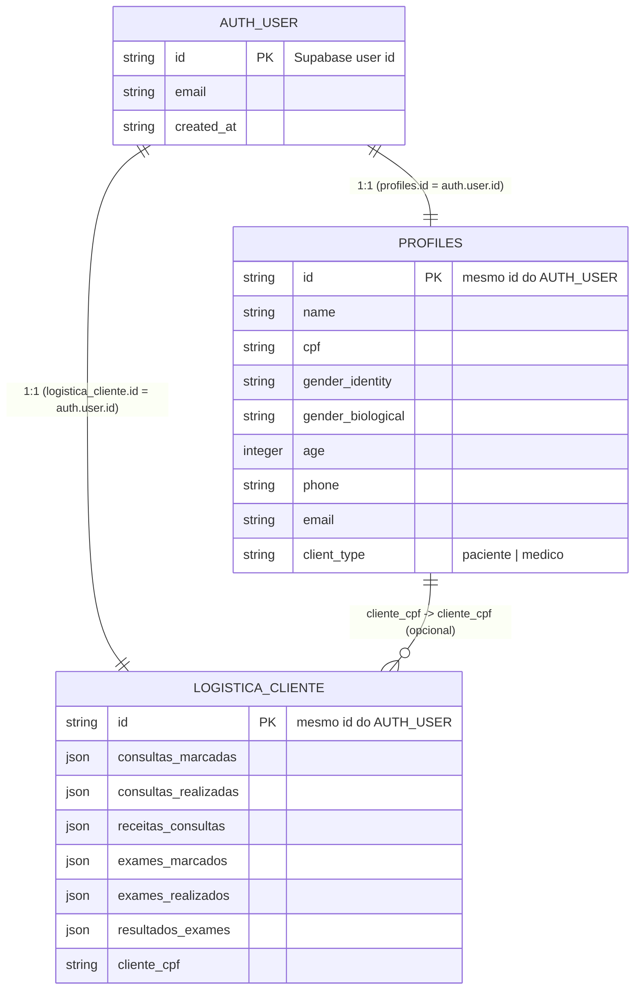
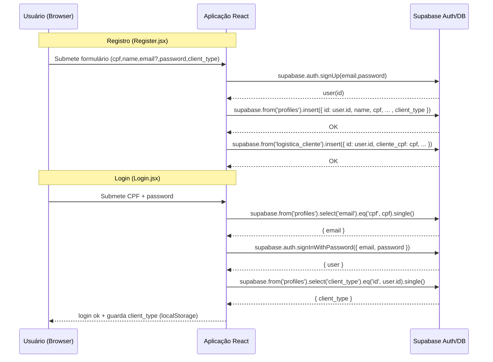

## Diagrama de Identidades (Identity Diagram)

Este arquivo descreve as entidades de identidade e os fluxos de autenticação observados no projeto.

Arquivos referenciados:

- `src/supabaseClient.js` — cliente Supabase (criação do client)
- `src/Register.jsx` — fluxo de registro (signUp + criação de `profiles` e `logistica_cliente`)
- `src/Login.jsx` — fluxo de login (consulta `profiles` por CPF, signInWithPassword e leitura de `client_type`)

---

### Diagrama ER (Mermaid)

---

### Fluxos principais (Mermaid sequence)

---

### Observações e suposições

- O projeto usa o Auth do Supabase para gerenciar credenciais (e-mail/senha). As tabelas adicionais (ex.: `profiles`, `logistica_cliente`) armazenam dados de perfil e logística do cliente.
- A coluna `profiles.client_type` é usada como um papel simples: valores observados no código são `paciente` e `medico`.
- O `profiles.id` é explicitamente definido para ser igual ao `user.id` retornado pelo Supabase — portanto há relação 1:1 entre o usuário do Auth e a linha de `profiles`.
- O login usa CPF para localizar o e-mail em `profiles` e então chama `signInWithPassword` com o e-mail. Em alguns casos, se não houver e-mail, o código gera um e-mail do formato `${cpf}@fakecpf.local`.
- Sessões e tokens são gerenciados pelo Supabase Auth (não se vê manipulação direta de tokens no frontend além do uso do cliente `supabase`).

### Recomendações / próximos passos

- Se precisar de papéis/permissões mais ricos, adicionar uma tabela `roles` e uma relação many-to-many `user_roles` ou adicionar `role` como campo enumerado em `profiles`.
- Para auditoria e controle de sessão, considerar armazenar logs de login (ex.: `auth_events`) e/ou usar políticas RLS no Supabase.
- Se quiser, posso gerar um diagrama UML adicional (class/sequence em PNG/SVG) ou exportar este Mermaid como SVG.

---

### Como visualizar

- No VS Code: instale a extensão "Markdown Preview Mermaid Support" ou "Mermaid Preview" e abra este arquivo para ver o diagrama renderizado.
- Ou cole os blocos Mermaid em https://mermaid.live/ para renderizar/baixar como SVG.

---

Referências no código:

- `src/supabaseClient.js`
- `src/Register.jsx` (criação de `profiles` e `logistica_cliente`)
- `src/Login.jsx` (fluxo de login por CPF)
